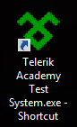
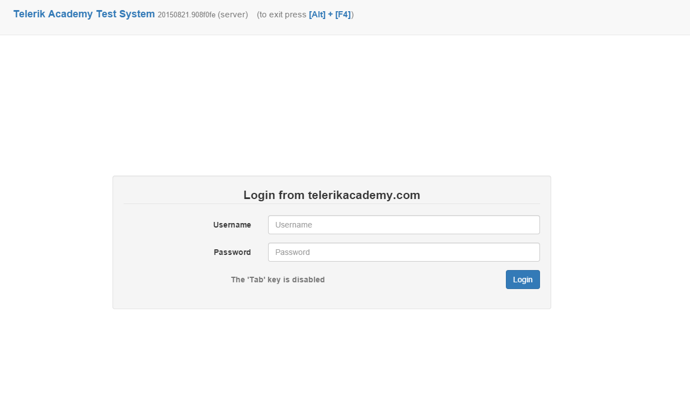

<!-- section start -->

<!-- attr: {id: 'title', class: 'slide-title', hasScriptWrapper: true} -->
# Telerik Kids
## Как да стартирам изпита?

    
Telerik Kids

    
Telerik Software Academy

    <a href="http://academy.telerik.com" class="signature-link">http://academy.telerik.com</a>

<!-- section start -->

<!-- attr: {class: 'slide-section'} -->
# Как да стартирам изпита?
## За компютрите в залата

<!-- attr: {} -->
# Как да се логна?
* Username: **Kids**
* Password: **Programirane**

<!-- section start -->

<!-- attr: {class: 'slide-section'} -->
# Как да стартирам изпита?
## За всикчи компютри

<!-- attr: {} -->
# Свързване с интернет
* Уверете се, че сте свързани с Интернет
  * С кабел или wifi
    * Парола за **TelerikAcademy** ==> **Ta$tud3ntsN3tw0rk**

<!-- attr: {} -->
# Стартиране на тестовата система
* Пуска се от тази иконка

* Ако работи, ще се появи

